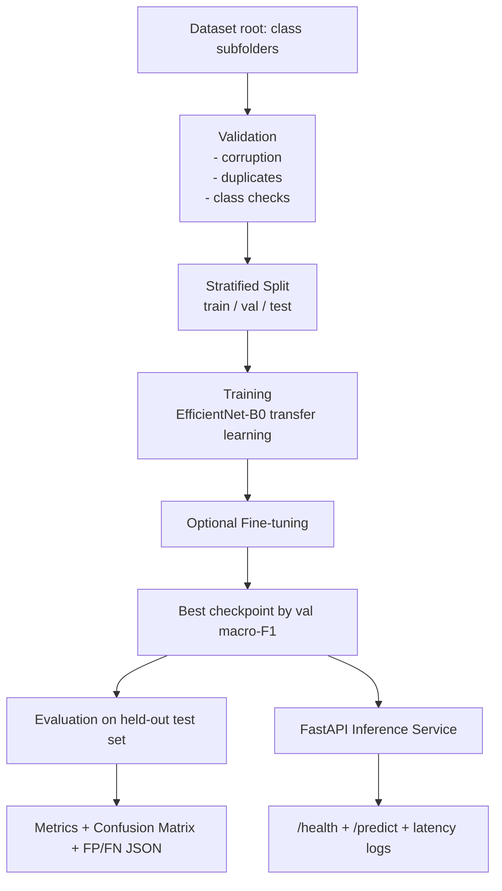

# Visual Defect Detection System

End-to-end, YAML-driven visual defect classification pipeline using **PyTorch + EfficientNet-B0 + FastAPI**.

## Features

- Modular Python package (`src/visual_defect_detection`)
- YAML-driven config (`configs/default.yaml`)
- Dataset validation before training:
  - class/size checks
  - image corruption checks
  - duplicate file checks (SHA-256)
- Stratified train/val/test splitting
- Data leakage prevention (split overlap check)
- Realistic augmentation for training
- Class imbalance detection with conditional weighted sampling/loss
- Transfer learning (frozen backbone) + optional fine-tuning
- Best checkpoint saved by **validation macro F1**
- Test-set evaluation with:
  - accuracy / precision / recall / macro F1
  - confusion matrix
  - false-positive/false-negative analysis
- FastAPI service with `/health` and `/predict`
- Upload validation + clean API errors
- Structured JSON logging + inference latency
- Automated tests
- Docker + docker-compose support

## Project Structure

```text
.
├── configs/
│   └── default.yaml
├── src/visual_defect_detection/
│   ├── __main__.py
│   ├── api.py
│   ├── config.py
│   ├── data.py
│   ├── evaluate.py
│   ├── inference.py
│   ├── logging_utils.py
│   ├── modeling.py
│   ├── train.py
│   └── utils.py
├── tests/
│   ├── test_api.py
│   └── test_data_validation.py
├── Dockerfile
├── docker-compose.yml
├── pyproject.toml
└── requirements.txt
```

## Architecture



## Installation

```bash
python -m venv .venv
source .venv/bin/activate
pip install -e .[dev]
```

## Dataset Format

Expected layout:

```text
data/raw/
  class_a/
    img1.png
    img2.png
  class_b/
    img3.png
```

The first directory level under `raw_dir` is used as class label.

## Training

```bash
python -m visual_defect_detection train --config configs/default.yaml
```

Outputs:

- `checkpoints/best_model.pt`
- `artifacts/training_summary.json`
- `artifacts/splits/{train,val,test}.csv`
- `artifacts/class_names.json`

## Evaluation

```bash
python -m visual_defect_detection evaluate --config configs/default.yaml --model-path checkpoints/best_model.pt
```

Outputs:

- `artifacts/evaluation/metrics.json`
- `artifacts/evaluation/confusion_matrix.png`
- `artifacts/evaluation/classification_report.json`
- `artifacts/evaluation/fp_fn_analysis.json`

## Run API

```bash
python -m visual_defect_detection serve --config configs/default.yaml --model-path checkpoints/best_model.pt
```

### Endpoints

- `GET /health`
- `POST /predict` (`multipart/form-data`, field: `file`)

## Docker

Build and run:

```bash
docker build -t visual-defect-detection .
docker run --rm -p 8000:8000 visual-defect-detection
```

Using compose:

```bash
docker compose up --build
```

## Automated Tests

```bash
pytest tests/test_data_validation.py tests/test_api.py -q
```

## Actual Experiment Results (from executed run)

> No real dataset was present in the repository workspace at implementation time. The executed pipeline run used a temporary local dataset at `/tmp/vdd_data/raw` and produced genuine metrics below.

### Data validation & split

- Valid images: **45**
- Removed duplicates: **1**
- Corrupted files skipped: **1**
- Split counts: **train 27 / val 9 / test 9**
- Class counts: **dent 15 / ok 15 / scratch 15**

### Training summary

- Best validation macro F1: **0.7746**
- Best checkpoint criterion: **highest val macro F1**
- Imbalance strategy applied: **false** (balanced dataset)

### Test metrics

- Accuracy: **0.6667**
- Precision (macro): **0.7500**
- Recall (macro): **0.6667**
- F1 (macro): **0.6429**
- Test samples: **9**

### FP/FN highlights

- `ok` false negatives: 1
- `scratch` false negatives: 2
- `dent` false positives: 1

## Example Inference (actual run)

Request image: `/tmp/vdd_data/raw/dent/dent_1.png`

Response:

```json
{
  "predicted_label": "dent",
  "confidence": 0.5200391411781311,
  "probabilities": {
    "dent": 0.5200391411781311,
    "ok": 0.2528602182865143,
    "scratch": 0.22710064053535461
  },
  "latency_ms": 13.610962000029758
}
```

## Engineering Decisions (concise)

- **Config-first design:** all tunables in YAML for reproducibility and environment portability.
- **Validation before training:** fail-fast on missing/invalid data and skip unusable samples safely.
- **No-leakage splitting:** strict disjoint stratified splits and overlap guard.
- **Selective imbalance handling:** weighted strategies only when imbalance ratio exceeds threshold.
- **Checkpointing by val F1:** aligns with multi-class quality over raw accuracy.
- **Production API behavior:** strict upload validation, structured logs, and latency capture.

## Limitations

- Current model is classification-only (no localization/segmentation).
- Duplicate check is exact-file hash based (not perceptual near-duplicate matching).
- API loads one model checkpoint at startup (no model registry/versioning).
